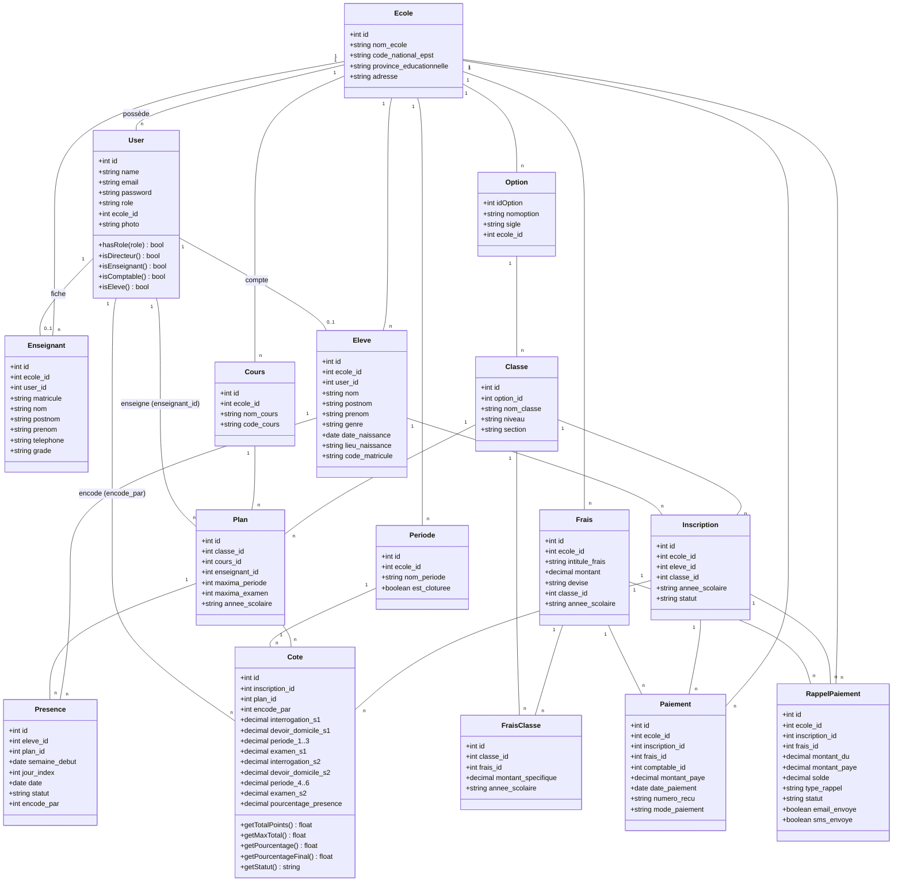
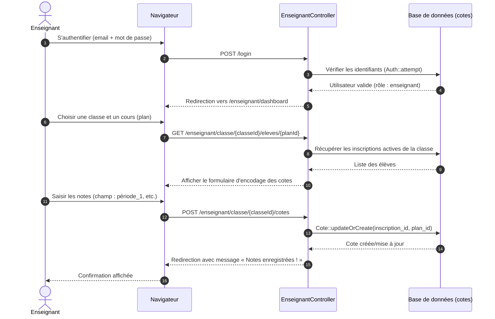
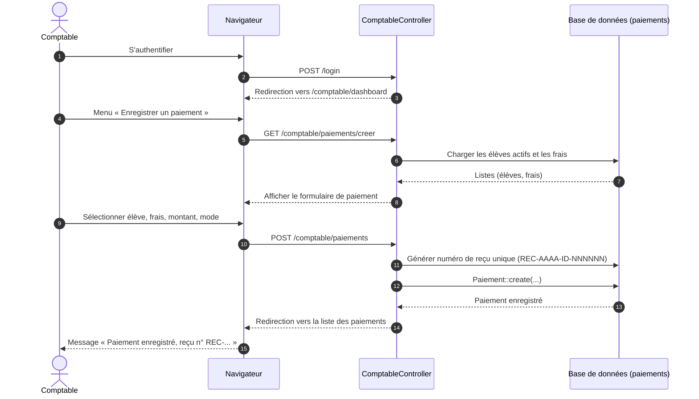
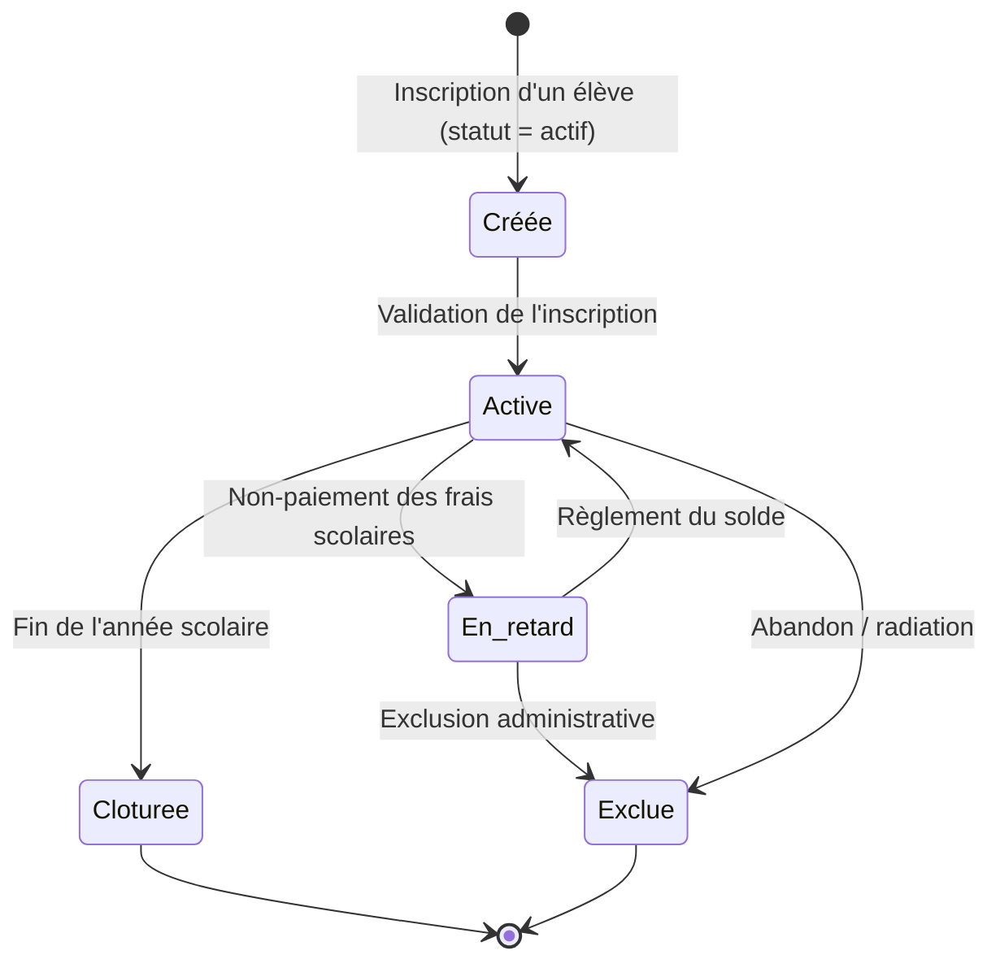
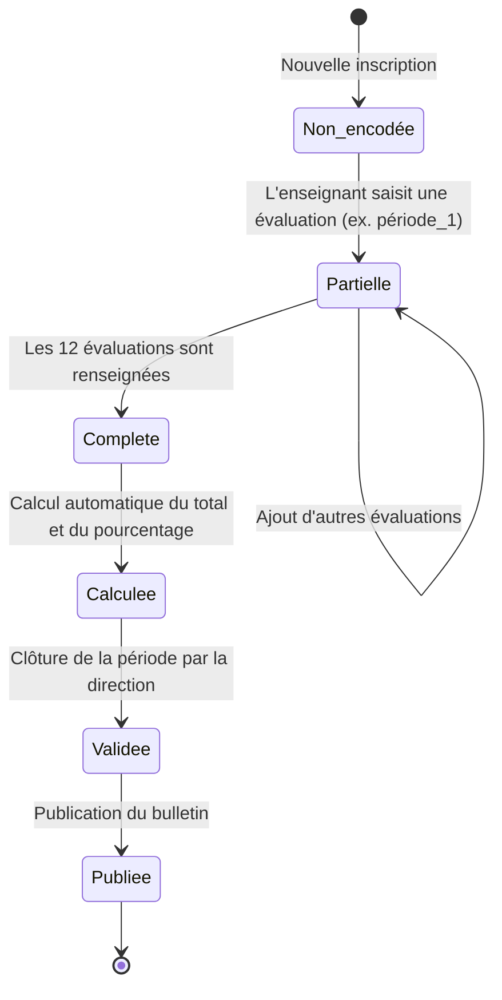

# DOCUMENTATION DU PROJET TUTORÉ — LICENCE 3 (L3)

> **Canevas** : Canevas minimum du projet tutoré en Sciences Informatiques (L1–L3)
> **Année académique** : 2024–2025 — Classes montantes
> **Niveau** : Licence 3 (L3) — Conception UML
> **Encadreur / Promoteur** : Dr Rodrigue KALUMENDO

---

## 1. TITRE DU PROJET

**Système académique intelligent pour les écoles secondaires : inscription en ligne, gestion des notes, paiements, tableaux de bord pour la direction.**

### Titre court (soutenance) :
> *Plateforme web de gestion académique intégrée pour établissements d'enseignement secondaire.*

**Domaine d'application** : Gestion scolaire / Administration académique / Suivi des performances et de la scolarité.

---

## 2. CONTEXTE ET JUSTIFICATION

### 2.1 Contexte technologique et social

Dans la plupart des écoles secondaires en République Démocratique du Congo (notamment dans les villes de l'Est comme Butembo, Beni et Goma), la gestion académique repose encore sur des méthodes manuelles : registres papier, cahiers de cotes, calculs à la main et fichiers éparpillés. Ces pratiques engendrent plusieurs problèmes :

- **Perte et altération des archives** (bulletins, registres matricules, historiques de paiement) ;
- **Lenteur dans la production des bulletins** et des relevés de notes ;
- **Erreurs de calcul** des moyennes et des pourcentages ;
- **Difficulté de suivi des frais scolaires** (minerval, frais de participation) et des soldes par élève ;
- **Manque de visibilité** pour la direction sur les performances globales de l'établissement ;
- **Communication difficile** avec les parents (retards de paiement non signalés, résultats non accessibles).

### 2.2 Intérêt du projet

Ce projet répond à un besoin réel et urgent de digitalisation. Il permet de :

- **Centraliser** toutes les données académiques et financières d'une école dans une base de données unique et sécurisée ;
- **Automatiser** le calcul des cotes, des moyennes, des pourcentages et des bulletins ;
- **Sécuriser** les informations par authentification et cloisonnement multi-écoles (chaque école ne voit que ses données) ;
- **Simplifier** le travail des enseignants (encodage des cotes et présences), du comptable (frais, paiements, rappels) et de la direction (tableaux de bord, supervision) ;
- **Offrir aux élèves** un espace personnel de consultation des notes, bulletins et de la situation financière.

### 2.3 Lien avec les compétences informatiques mobilisées

Le projet mobilise l'ensemble des compétences du parcours de Licence en Sciences Informatiques :

| Domaine | Compétences mises en œuvre |
|---|---|
| **Analyse et conception** | Recueil des besoins, diagrammes UML (cas d'utilisation, classes, séquence, activités, états), architecture MVC |
| **Développement** | Programmation en PHP (Laravel 12), SQL, Blade, HTML/CSS (Tailwind), JavaScript |
| **Base de données** | Modélisation relationnelle, migrations, requêtes Eloquent, MySQL/SQLite |
| **Génie logiciel** | Gestion de versions (Git/GitHub), tests, documentation, méthodologie en cascade/cycle en V |
| **Sécurité** | Authentification, contrôle d'accès par rôle, validation des données, protection CSRF |
| **Gestion de projet** | Planification, répartition des tâches, suivi, communication |

---

## 3. PROBLÉMATIQUE

La problématique centrale qui guide ce projet est formulée comme suit :

> **Comment concevoir et développer une plateforme web sécurisée, fiable et adaptée aux réalités des écoles secondaires congolaises, permettant la gestion intégrée des inscriptions en ligne, des notes et cotes, des présences, des paiements des frais scolaires ainsi que la production automatique des bulletins et des tableaux de bord pour la direction ?**

Cette question principale se décline en sous-questions :

1. Comment modéliser les entités académiques (élèves, classes, cours, enseignants, inscriptions, cotes) de manière cohérente et extensible ?
2. Comment garantir la sécurité des données et le cloisonnement entre plusieurs écoles ?
3. Comment automatiser le calcul des moyennes, des pourcentages et l'édition des bulletins ?
4. Comment assurer le suivi financier (frais, paiements, soldes) et les rappels automatiques aux parents ?
5. Comment offrir des tableaux de bord pertinents aux différents acteurs (direction, enseignant, comptable, élève) ?

---

## 4. OBJECTIFS DU PROJET

### 4.1 Objectif général

Développer une solution informatique web complète — le **Système académique intelligent** — répondant au besoin de digitalisation de la gestion académique et financière des écoles secondaires.

### 4.2 Objectifs spécifiques

- **OS1** : Identifier les besoins fonctionnels et techniques des utilisateurs (direction, enseignants, comptables, élèves, parents) ;
- **OS2** : Concevoir l'architecture du système selon les normes méthodologiques UML (diagrammes de cas d'utilisation, de classes, de séquence, d'activités et d'états) ;
- **OS3** : Développer et tester la solution (module d'authentification, inscription des élèves, gestion des cotes et présences, gestion des frais et paiements, génération des bulletins, rappels automatiques) ;
- **OS4** : Gérer les ressources humaines, matérielles et financières du projet (organisation de l'équipe, planification, suivi) ;
- **OS5** : Documenter et présenter le projet (documentation technique, manuel utilisateur, soutenance avec démonstration).

### 4.3 Vue d'ensemble de l'application

L'application entière est conçue comme une plateforme web académique centralisée pour l'administration, le suivi pédagogique, la gestion financière et la communication avec les acteurs scolaires. Elle permet de gérer l'ensemble du cycle de vie scolaire d'un établissement, depuis l'inscription d'un élève jusqu'à la production des bulletins et au suivi des paiements.

#### 4.3.1 Modules principaux

- **Module d'authentification et gestion des utilisateurs** : connexion sécurisée, rôles (direction, enseignant, comptable, élève), gestion des comptes et permissions ;
- **Module de gestion des écoles et des classes** : création d'écoles, gestion des classes, options, cours, périodes et niveaux ;
- **Module des élèves et inscriptions** : inscription en ligne, matrícules automatiques, fichiers d'élèves, historique scolaire ;
- **Module des enseignants et attributions** : affectation des cours, suivi des classes, gestion des matières enseignées ;
- **Module des notes et cotes** : saisie des évaluations, calcul des moyennes, production des résultats par matière et par période ;
- **Module des présences** : gestion des absences, retards, suivi hebdomadaire et analyse de la régularité ;
- **Module des frais et paiements** : gestion des frais scolaires, soldes, paiements, relances automatiques et rapports financiers ;
- **Module de génération des bulletins** : impression des bulletins, synthèses par période, statistiques de réussite ;
- **Module de tableaux de bord** : suivi des performances globales, indicateurs de satisfaction, statistiques de direction ;
- **Module d'accès élève** : consultation des notes, bulletins, soldes de paiement, historique académique ;
- **Module de notification et relance** : SMS, e-mails, rappels de paiement et alertes pédagogiques.

#### 4.3.2 Acteurs du système

- **Direction** : supervision générale, rapports, statistiques, validation des décisions ;
- **Enseignants** : saisie des notes, gestion des présences, suivi des performances par classe ;
- **Comptable** : suivi des frais, gestion des paiements, relances, états financiers ;
- **Élèves** : consultation des résultats, bulletins, compte personnel ;
- **Parents / tuteurs** : suivi financier et académique indirectement via l'élève ou les notifications ;
- **Administrateurs** : gestion globale du système, sécurisation et paramétrage des données.

#### 4.3.3 Objectif fonctionnel global

L'application vise à centraliser toutes les informations académiques et financières dans un système unique, fiable et évolutif. Elle permet d'automatiser les tâches répétitives, réduire les erreurs manuelles, accélérer la prise de décision et offrir une meilleure transparence à tous les acteurs de l'établissement.

---

## 5. MÉTHODOLOGIE DE RÉALISATION

### 5.1 Modèle de développement choisi

Le projet suit une **approche en cascade combinée au cycle en V**, structurée en phases séquentielles avec validation à chaque étape :

```
┌──────────────────────┐        ┌──────────────────────┐
│ 1. Analyse des besoins │ ────▶ │ 4. Tests unitaires   │
└──────────────────────┘        │    et fonctionnels   │
┌──────────────────────┐        └──────────────────────┘
│ 2. Conception UML     │ ────▶ ┌──────────────────────┐
└──────────────────────┘        │ 5. Validation         │
┌──────────────────────┐        │    et intégration     │
│ 3. Développement      │ ────▶ └──────────────────────┘
└──────────────────────┘        ┌──────────────────────┐
                                │ 6. Déploiement        │
                                │    et documentation   │
                                └──────────────────────┘
```

### 5.2 Outils techniques utilisés

| Catégorie | Outils |
|---|---|
| **Langages** | PHP 8.2, SQL, HTML5, CSS3, JavaScript |
| **Framework** | Laravel 12 (architecture MVC, Eloquent ORM, Blade) |
| **Base de données** | MySQL (production) / SQLite (développement) |
| **Interface** | Tailwind CSS, Font Awesome |
| **Conception UML** | Draw.io, Mermaid |
| **IDE** | VS Code, PhpStorm |
| **Gestion de versions** | Git, GitHub |
| **Tests** | PHPUnit, tests manuels fonctionnels |
| **Autres** | Composer, Artisan CLI, Mailtrap/SMTP pour les emails de rappel |

### 5.3 Étapes clés de réalisation

1. **Analyse des besoins** : entretiens avec les responsables d'école, cahier des charges, questionnaire ;
2. **Conception UML** : diagramme de cas d'utilisation, diagramme de classes, diagrammes de séquence, diagrammes d'activités, diagramme d'états ;
3. **Développement** : configuration Laravel, création des migrations et modèles, implémentation des contrôleurs et vues par module ;
4. **Tests** : tests unitaires des calculs (moyennes, pourcentages), tests fonctionnels des parcours utilisateurs (authentification, inscription, encodage, paiement), correction des anomalies ;
5. **Déploiement** : déploiement sur un serveur web, configuration de l'environnement de production ;
6. **Documentation** : rapport technique, manuel utilisateur, présentation finale.

---

## 6. ANALYSE DES BESOINS

### 6.1 Utilisateurs cibles

| Acteur | Description | Besoins principaux |
|---|---|---|
| **Directeur** | Responsable de l'établissement | Tableau de bord, gestion des options/classes/cours, inscriptions, supervision des cotes, gestion des comptes utilisateurs, rapports |
| **Enseignant** | Personnel enseignant | Encodage des cotes (12 évaluations), gestion des présences hebdomadaires, consultation de ses classes/cours |
| **Comptable** | Gestionnaire financier | Gestion des frais, enregistrement des paiements, reçus, relevés par élève, rappels de paiement automatiques (email/SMS) |
| **Élève** | Apprenant | Consultation des notes, des bulletins, de la situation financière et du profil |
| **Parent** (bénéficiaire indirect) | Tuteur de l'élève | Réception des rappels de paiement, suivi des résultats (via l'élève) |

### 6.2 Fonctionnalités attendues

#### Module Authentification & Utilisateurs
- Inscription de l'établissement (école + compte directeur) ;
- Connexion / déconnexion sécurisée (routage par rôle) ;
- Création et gestion des comptes (enseignant, comptable, élève) ;
- Réinitialisation du mot de passe, photo de profil.

#### Module Direction
- Tableau de bord avec statistiques (options, classes, cours, enseignants, élèves, utilisateurs) ;
- Gestion des options, années scolaires, classes, cours ;
- Gestion du corps enseignant et attribution des cours aux classes (plans) ;
- Registre des élèves (inscription, matricule automatique, fiche individuelle) ;
- Supervision de l'encodage des cotes par les enseignants (avec statistiques de réussite) ;
- Génération et impression des bulletins de notes.

#### Module Enseignant
- Tableau de bord (cours assignés, nombre d'élèves, périodes actives) ;
- Encodage des cotes par classe et par cours (12 champs d'évaluation) ;
- Saisie des présences hebdomadaires (grille élève × jours, Lun–Ven) ;
- Calcul automatique du pourcentage de présence et bonus de présence ;
- Consultation de son profil.

#### Module Comptable
- Tableau de bord financier (total encaissé, nombre de paiements, frais) ;
- Gestion des frais (intitulé, montant, classe, année scolaire) ;
- Enregistrement des paiements avec numéro de reçu unique ;
- Relevé de compte par élève (total dû, total payé, solde) ;
- Configuration et déclenchement des rappels de paiement automatiques (email/SMS), journal des rappels.

#### Module Élève
- Tableau de bord (moyenne générale, cours suivis, bulletins disponibles, situation financière) ;
- Consultation des notes détaillées par cours ;
- Consultation des bulletins (périodes clôturées) ;
- Consultation de la situation financière et du profil.

### 6.3 Contraintes

**Contraintes techniques**
- Cloisonnement strict des données par école (`ecole_id`) ;
- Compatibilité navigateur (application web responsive) ;
- Disponibilité réduite de la connexion Internet dans certaines zones → interface légère ;
- Utilisation de SQLite en développement pour faciliter le déploiement local.

**Contraintes ergonomiques**
- Interface simple, en français, adaptée aux utilisateurs non experts ;
- Formulaires clairs avec validation et messages d'erreur compréhensibles ;
- Impression correcte des bulletins.

**Contraintes sécuritaires**
- Authentification obligatoire, mots de passe hachés (bcrypt) ;
- Contrôle d'accès par rôle (directeur, enseignant, comptable, élève) ;
- Protection CSRF, validation des entrées, requêtes préparées (Eloquent) ;
- Empêcher la suppression du compte du directeur connecté.

### 6.4 Outils d'analyse recommandés

- **Cahier des charges** (annexe) ;
- **Entretiens / questionnaires** auprès des responsables d'écoles secondaires ;
- **Diagramme de cas d'utilisation UML** (section 7).

---

## 7. CONCEPTION DU SYSTÈME — MÉTHODE UML (LICENCE 3)

> Les diagrammes ci-dessous sont produits avec **Mermaid** (rendus automatiquement dans VS Code, GitHub, GitLab et Typora). Ils représentent la conception du système réellement implémenté dans le projet.

### 7.1 Diagramme de cas d'utilisation

```mermaid
graph TD
    subgraph Systeme["Système Académique Intelligent"]
        UC1["S'authentifier"]
        UC2["Gérer les options"]
        UC3["Gérer les années scolaires"]
        UC4["Gérer les classes"]
        UC5["Gérer les cours"]
        UC6["Gérer le corps enseignant"]
        UC7["Attribuer les cours aux classes"]
        UC8["Inscrire un élève"]
        UC9["Gérer les cotes"]
        UC10["Saisir les présences"]
        UC11["Superviser les cotes"]
        UC12["Consulter les bulletins"]
        UC13["Gérer les frais"]
        UC14["Enregistrer les paiements"]
        UC15["Générer les reçus et relevés"]
        UC16["Configurer les rappels de paiement"]
        UC17["Gérer les comptes utilisateurs"]
        UC18["Consulter ses notes"]
        UC19["Consulter sa situation financière"]
    end

    Directeur["Directeur"]
    Enseignant["Enseignant"]
    Comptable["Comptable"]
    Eleve["Élève"]

    Directeur --> UC1
    Enseignant --> UC1
    Comptable --> UC1
    Eleve --> UC1

    Directeur --> UC2
    Directeur --> UC3
    Directeur --> UC4
    Directeur --> UC5
    Directeur --> UC6
    Directeur --> UC7
    Directeur --> UC8
    Directeur --> UC11
    Directeur --> UC12
    Directeur --> UC17

    Enseignant --> UC9
    Enseignant --> UC10
    Enseignant --> UC12

    Comptable --> UC13
    Comptable --> UC14
    Comptable --> UC15
    Comptable --> UC16

    Eleve --> UC18
    Eleve --> UC19
    Eleve --> UC12
```



### 7.2 Diagramme de classes



### 7.3 Diagramme de séquence — Encodage d'une cote par l'enseignant



### 7.4 Diagramme de séquence — Enregistrement d'un paiement (comptable)



### 7.5 Diagramme d'activités — Inscription d'un élève

```mermaid
flowchart TD
    A([Début : Le directeur ouvre le formulaire d'inscription]) --> B[Choisir la classe et l'année scolaire]
    B --> C[Saisir les informations de l'élève<br/>nom, postnom, prénom, genre, naissance]
    C --> D{Email fourni ?}
    D -- Oui --> E[Créer un compte utilisateur élève]
    E --> F[Générer le code matricule unique<br/>MT-AAAA-ecoleId-NNNN]
    D -- Non --> F
    F --> G[Enregistrer l'élève dans la table eleves]
    G --> H[Créer l'inscription dans la table inscriptions]
    H --> I{Enregistrement réussi ?}
    I -- Oui --> J([Fin : Redirection avec message de succès])
    I -- Non --> K[Annuler la transaction (rollback)]
    K --> L[Afficher un message d'erreur]
    L --> C
```

### 7.6 Diagramme d'activités — Génération du bulletin de notes

```mermaid
flowchart TD
    A([Début : Consultation du bulletin]) --> B[Charger l'inscription de l'élève]
    B --> C[Charger les périodes de l'école]
    C --> D[Charger les plans (cours) de la classe pour l'année]
    D --> E[Récupérer toutes les cotes de l'inscription]
    E --> F[Grouper les cotes par cours et par période]
    F --> G[Calculer la moyenne par cours]
    G --> H[Calculer la moyenne générale]
    H --> I[Déterminer la mention<br/>>=16 Très Bien, >=14 Bien, >=12 Assez Bien, >=10 Passable]
    I --> J[Afficher le bulletin à l'écran]
    J --> K{Impression ?}
    K -- Oui --> L[Appliquer les styles d'impression<br/>et imprimer le document]
    K -- Non --> M([Fin])
    L --> M
```

### 7.7 Diagramme d'états — Cycle de vie d'une inscription



### 7.8 Diagramme d'états — État d'une cote (évaluation)



---

## 8. PLANIFICATION TEMPORELLE

| Phase du projet | Activité principale | Durée estimée | Période prévue |
|---|---|---|---|
| **Préparation** | Analyse des besoins, cahier des charges, questionnaire | 1 semaine | Semaine 1 |
| **Conception** | Diagrammes UML (cas d'utilisation, classes, séquence, activités, états) | 2 semaines | Semaines 2–3 |
| **Développement** | Codage et intégration des modules (auth, direction, enseignant, comptable, élève) | 3 semaines | Semaines 4–6 |
| **Tests** | Vérification, validation, correction des anomalies | 1 semaine | Semaine 7 |
| **Documentation** | Rapport technique, manuel utilisateur | 1 semaine | Semaine 8 |
| **Soutenance** | Présentation finale avec démonstration | 1 semaine | Semaine 9 |

### Décomposition détaillée du développement (semaines 4–6)

| Semaine | Tâches |
|---|---|
| **Semaine 4** | Configuration Laravel, base de données (migrations), authentification et gestion des utilisateurs, gestion des options/classes/cours |
| **Semaine 5** | Module inscriptions (élèves, matricules), module enseignants (attributions, encodage des cotes, présences) |
| **Semaine 6** | Module comptable (frais, paiements, reçus, relevés), rappels automatiques, module élève (notes, bulletins, finances), tableaux de bord, impressions |

---

## 9. RESSOURCES MATÉRIELLES ET LOGICIELLES

### 9.1 Ressources matérielles

| Ressource | Utilisation |
|---|---|
| **Ordinateur portable (développeur)** | Développement, tests, rédaction de la documentation |
| **Connexion Internet** | Recherche, documentation, synchronisation Git/GitHub, déploiement |
| **Serveur web / hébergement** | Déploiement de l'application en ligne |
| **Téléphone / tablette** | Tests de compatibilité mobile de l'interface |

### 9.2 Ressources logicielles

| Catégorie | Outils |
|---|---|
| **Système d'exploitation** | Windows 11, Linux (serveur) |
| **IDE** | VS Code, PhpStorm |
| **Outils de conception** | Draw.io, Figma, Mermaid |
| **Gestion de version** | Git, GitHub |
| **Base de données** | MySQL, SQLite |
| **Framework** | Laravel 12, Tailwind CSS |
| **Serveur local** | XAMPP / WAMP / PHP artisan serve |
| **Email / SMS** | Mailtrap (développement), SMTP de production, passerelle SMS |
| **Tests** | PHPUnit, Postman (tests API éventuels) |

---

## 10. RÉSULTATS ATTENDUS

À l'issue de ce projet, les résultats suivants sont attendus :

1. **Une solution fonctionnelle** : plateforme web complète (authentification, inscription en ligne, gestion des notes, présences, paiements, tableaux de bord, bulletins imprimables) ;
2. **Une documentation technique complète** : architecture, modèle de données, diagrammes UML, manuel de déploiement ;
3. **Un manuel utilisateur** : guide d'utilisation pour la direction, les enseignants, le comptable et les élèves ;
4. **Une présentation finale avec démonstration** : soutenance du projet avec démonstration en direct des principales fonctionnalités ;
5. **Des recommandations** pour l'amélioration et le déploiement réel du système ;
6. **Un dépôt Git/GitHub** contenant le code source versionné.

---

## 11. LIMITES ET PERSPECTIVES

### 11.1 Limites du projet

| Limite | Description |
|---|---|
| **Accès restreint aux données réelles** | Difficulté d'obtenir des données complètes d'une école réelle pour les tests (anonymisation, disponibilité) |
| **Contraintes de temps et de matériel** | Durée limitée du projet tutoré (9 semaines), matériel de développement limité |
| **Niveau technique des utilisateurs finaux** | Certains utilisateurs (enseignants, comptables) ont une faible culture numérique → besoin de formation et d'interfaces simplifiées |
| **Connectivité Internet** | Zones à faible couverture Internet → limitations du déploiement 100 % en ligne |
| **Sécurité** | Nécessité d'un durcissement supplémentaire pour une mise en production réelle (HTTPS, sauvegardes, pare-feu) |

### 11.2 Perspectives

| Perspective | Description |
|---|---|
| **Extension géographique** | Déploiement dans d'autres villes et provinces de la RDC (Butembo, Beni, Goma, Kinshasa, Lubumbashi…) |
| **IA pour l'analyse prédictive** | Intégration d'un module d'intelligence artificielle pour prévoir les performances scolaires, détecter les risques d'échec et identifier les élèves qui ont besoin d'un accompagnement rapide |
| **Sécurité renforcée** | Authentification à deux facteurs (2FA), journalisation avancée, chiffrement des données sensibles |
| **Application mobile** | Développement d'une application mobile (React Native) pour les parents et les élèves |
| **Notifications temps réel** | Envoi de SMS/email automatiques pour les absences, les résultats et les échéances de paiement |
| **Déploiement réel et maintenance continue** | Hébergement professionnel, sauvegardes automatiques, formation des utilisateurs, support |
| **Module de communication** | Espace parent avec messagerie, suivi en temps réel des notes et présences |

### 11.3 Volet d'intelligence artificielle pour la prédiction des performances

Une amélioration majeure de la plateforme consiste à intégrer un module d'intelligence artificielle capable d'anticiper les difficultés scolaires avant qu'elles ne deviennent graves. L'objectif est de transformer les données académiques déjà présentes dans le système en informations exploitables pour la direction, les enseignants et les conseillers pédagogiques.

#### 11.3.1 Problème à résoudre

Dans de nombreuses écoles, les élèves en difficulté ne sont souvent identifiés qu'après plusieurs semaines ou plusieurs évaluations, ce qui réduit l'efficacité des interventions. Les causes peuvent être multiples : faiblesse en mathématiques, absences récurrentes, retard dans les paiements, baisse de motivation, manque de suivi parental ou difficultés psychologiques.

#### 11.3.2 Données utiles pour la prédiction

Le système peut exploiter les données déjà enregistrées dans la base, notamment :

- les notes par matière et par période ;
- les moyennes générales et l'évolution dans le temps ;
- les absences et retards ;
- la présence aux évaluations et aux devoirs ;
- les informations disciplinaires et de participation ;
- les frais scolaires payés ou non payés ;
- le niveau de la classe, l'option et les cours suivis.

À partir de ces éléments, un modèle de machine learning peut calculer un score de risque pour chaque élève et signaler les cas à surveiller.

#### 11.3.3 Fonctionnement du système proposé

Le module d'IA pourra fonctionner selon les étapes suivantes :

1. **Collecte et nettoyage des données** : récupération des informations académiques et comportementales depuis la base de données ;
2. **Analyse des performances** : calcul des tendances sur plusieurs périodes pour repérer les baisses de résultats ;
3. **Modélisation prédictive** : utilisation d'un algorithme supervisé ou semi-supervisé pour estimer le risque de sous-performance ;
4. **Détection précoce** : génération d'alertes lorsqu'un élève présente un score de risque élevé ;
5. **Recommandation pédagogique** : proposition d'actions ciblées (rattrapage, suivi personnalisé, conseil aux parents, ateliers de soutien). 

#### 11.3.4 Bénéfices pour l'établissement

L'intégration de l'IA permettrait à l'école de :

- identifier les élèves en difficulté avant les examens ou les bulletins ;
- réduire le taux d'échec et d'abandon scolaire ;
- aider les enseignants à intervenir plus tôt et de manière ciblée ;
- améliorer la prise de décision de la direction pour les actions de remédiation ;
- renforcer le suivi pédagogique et la communication avec les parents.

Cette extension intelligentifie la plateforme en la faisant passer d'un simple outil de gestion à un système d'aide à la décision pédagogique et de pilotage académique.

---

## 12. ANNEXES

Les annexes suivantes accompagnent la documentation du projet :

### A. Diagrammes UML (conception)
- Diagramme de cas d'utilisation (section 7.1) ;
- Diagramme de classes (section 7.2) ;
- Diagrammes de séquence (sections 7.3 et 7.4) ;
- Diagrammes d'activités (sections 7.5 et 7.6) ;
- Diagrammes d'états (sections 7.7 et 7.8).

### B. Captures d'écran de l'application
- Écran de connexion ;
- Tableau de bord du directeur ;
- Registre des élèves ;
- Formulaire d'encodage des cotes ;
- Feuille de présence hebdomadaire ;
- Liste des paiements et reçu ;
- Bulletin de notes imprimé ;
- Espace élève (notes, bulletins, finances).

### C. Code source
- Dépôt GitHub (lien à fournir) ;
- Structure Laravel : `app/Models`, `app/Http/Controllers`, `database/migrations`, `resources/views`, `routes/web.php`.

### D. Documents d'analyse
- Cahier des charges (à fournir) ;
- Questionnaire d'entretien avec les responsables d'établissement (à fournir).

### E. Journal de bord du projet
- Suivi hebdomadaire des activités, décisions et difficultés rencontrées (à compléter).

---

## RÉFÉRENCES AU CODE DU PROJET

| Composant | Fichier(s) principal(aux) |
|---|---|
| Modèles | `app/Models/` (User, Ecole, Eleve, Enseignant, Option, Classe, Cours, Plan, Periode, Inscription, Cote, Presence, Frais, FraisClasse, Paiement, RappelPaiement, ConfigRappel) |
| Contrôleurs | `app/Http/Controllers/` (CustomAuthController, InscriptionController, EnseignantController, ComptableController, EleveController, CorpsEnseignantController, RappelController, …) |
| Migrations | `database/migrations/` |
| Vues | `resources/views/` (directeur, enseignant, comptable, eleve, auth, users, options, annees) |
| Routes | `routes/web.php`, `routes/console.php` |
| Commandes | `app/Console/Commands/RappelsPaiement.php` (rappels automatiques) |
| Services | `app/Services/SmsService.php`, `app/Mail/RappelPaiementMail.php` |

---

*Document rédigé conformément au canevas minimum du projet tutoré en Sciences Informatiques (L1–L3) — Dr Rodrigue KALUMENDO, Classes montantes 2024–2025.*

